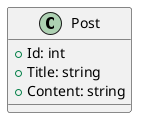

# 📚 Stack de Documentation BlogApi

Stack de documentation **complètement indépendante et portable** utilisant Docker et Docker Compose.

## 🎯 Objectif

Cette stack permet de générer une documentation technique complète du projet BlogApi au format HTML et PDF, de manière totalement automatisée et portable, sans aucune installation locale de Doxygen, LaTeX ou GraphViz.

## 🛠️ Prérequis

- **Docker** (version 20.10+)
- **Docker Compose** (version 2.0+)

**C'est tout !** Aucune autre installation n'est nécessaire.

## 📁 Structure de la stack

```
docs/
├── docker-compose.yml          # Configuration Docker Compose de la stack
├── README.md             # Ce fichier
├── doxygen/                    # Configuration Doxygen
│   ├── Doxyfile                # Configuration principale
│   ├── Dockerfile.doxygen      # Image Docker optimisée
│   ├── MAINPAGE.md             # Page d'accueil de la doc
│   └── diagrams/               # Diagrammes PlantUML
├── scripts/                    # Scripts d'automatisation
│   ├── docs-stack.ps1          # Script principal (PowerShell)
│   └── docs-stack.sh           # Script principal (Bash - Linux/Mac)
└── doxygen-output/             # Documentation générée (créé automatiquement)
    ├── html/                   # Documentation HTML
    └── latex/                  # Documentation LaTeX + PDF
        └── refman.pdf          # Documentation PDF finale

```

## 🚀 Utilisation rapide

### 1️⃣ Générer la documentation complète

```powershell
# Windows (PowerShell)
cd docs
.\scripts\docs-stack.ps1 -Action generate

# Linux/Mac (Bash)
cd docs
./scripts/docs-stack.sh generate
```

Cette commande :
- ✅ Construit l'image Docker (si nécessaire)
- ✅ Génère la documentation HTML et LaTeX
- ✅ Compile le PDF final
- ✅ Ouvre le PDF automatiquement

### 2️⃣ Visualiser la documentation HTML

```powershell
# Démarrer le serveur HTTP
cd docs
docker-compose --profile serve up -d

# Accéder à : http://localhost:8090
```

Pour arrêter le serveur :
```powershell
docker-compose --profile serve down
```

### 3️⃣ Commandes Docker Compose manuelles

```bash
# Construire l'image Docker
docker-compose build

# Générer uniquement la documentation HTML/LaTeX
docker-compose run --rm doxygen

# Compiler le PDF (après avoir généré la doc)
docker-compose --profile pdf run --rm pdflatex

# Nettoyer les conteneurs
docker-compose down
```

## 🎨 Services disponibles

### Service `doxygen`
- **Rôle** : Génère la documentation HTML et LaTeX à partir du code source
- **Entrée** : Code source C# (dossier parent `../`)
- **Sortie** : `doxygen-output/html/` et `doxygen-output/latex/`
- **Outils** : Doxygen, GraphViz, PlantUML

### Service `pdflatex`
- **Rôle** : Compile le fichier LaTeX en PDF
- **Entrée** : `doxygen-output/latex/refman.tex`
- **Sortie** : `doxygen-output/latex/refman.pdf`
- **Profile** : `pdf` (optionnel)

### Service `http-server`
- **Rôle** : Serveur HTTP pour visualiser la documentation HTML
- **Port** : `8090`
- **URL** : http://localhost:8090
- **Profile** : `serve` (optionnel)
- **Image** : nginx:alpine (léger)

## 📝 Personnalisation

### Modifier la configuration Doxygen

Éditez le fichier `doxygen/Doxyfile` :

```doxyfile
PROJECT_NAME           = "BlogApi"
PROJECT_NUMBER         = "v1.0"
PROJECT_BRIEF          = "API REST pour un blog"
OUTPUT_LANGUAGE        = French
EXTRACT_ALL            = YES
GENERATE_LATEX         = YES
GENERATE_HTML          = YES
```

### Ajouter des diagrammes

Placez vos diagrammes PlantUML (`.puml`) dans `doxygen/diagrams/`.

Exemple :


### Modifier la page d'accueil

Éditez le fichier `doxygen/MAINPAGE.md` pour personnaliser la page d'accueil de la documentation.

## 🔧 Scripts d'automatisation

### PowerShell (Windows)

```powershell
# Générer la documentation complète
.\scripts\docs-stack.ps1 -Action generate

# Seulement construire l'image
.\scripts\docs-stack.ps1 -Action build

# Nettoyer les fichiers générés
.\scripts\docs-stack.ps1 -Action clean

# Démarrer le serveur HTTP
.\scripts\docs-stack.ps1 -Action serve

# Afficher l'aide
.\scripts\docs-stack.ps1 -Action help
```

### Bash (Linux/Mac)

```bash
# Générer la documentation complète
./scripts/docs-stack.sh generate

# Seulement construire l'image
./scripts/docs-stack.sh build

# Nettoyer les fichiers générés
./scripts/docs-stack.sh clean

# Démarrer le serveur HTTP
./scripts/docs-stack.sh serve

# Afficher l'aide
./scripts/docs-stack.sh help
```

## 📦 Portabilité

Cette stack est **100% portable** :

1. **Copier le dossier `docs/`** vers n'importe quel projet
2. **Ajuster les chemins** dans `docker-compose.yml` si nécessaire
3. **Personnaliser** le `Doxyfile` selon votre projet
4. **Lancer** la génération !

### Réutilisation pour un autre projet

```yaml
# docker-compose.yml - Adaptez ces lignes
services:
  doxygen:
    volumes:
      # Changez "../" vers votre dossier source
      - ../mon-projet:/docs:ro
```

## 🐳 Image Docker

L'image Docker (`Dockerfile.doxygen`) contient :

- **OS** : Alpine Linux 3.19 (léger)
- **Doxygen** : Génération de documentation
- **GraphViz** : Génération de diagrammes
- **TeX Live** : Compilation LaTeX → PDF
- **PlantUML** : Diagrammes UML
- **Java 17 JRE** : Pour PlantUML

**Taille** : ~4.2 GB (à cause de TeX Live complet)

## 🎯 Cas d'usage

### Pour un TPI (Travail Pratique Individuel)

1. Générer la documentation complète
2. Récupérer le PDF : `doxygen-output/latex/refman.pdf`
3. Renommer : `NOM_Prenom_CodeSource_TPI.pdf`
4. Remettre aux experts

### Pour une review de code

1. Démarrer le serveur HTTP : `docker-compose --profile serve up -d`
2. Partager le lien : http://localhost:8090
3. Naviguer dans la documentation interactive

### Pour l'intégration continue (CI/CD)

```yaml
# .github/workflows/docs.yml
- name: Generate documentation
  run: |
    cd docs
    docker-compose run --rm doxygen
    docker-compose --profile pdf run --rm pdflatex
```

## 🧹 Nettoyage

```bash
# Supprimer les fichiers générés
rm -rf doxygen-output

# Supprimer l'image Docker
docker rmi blogapi-doxygen

# Supprimer tout (conteneurs, images, volumes)
docker-compose down --volumes --rmi all
```

## 🆘 Dépannage

### Problème : "permission denied"

**Solution** : Vérifiez les permissions du dossier `doxygen-output/`

```bash
chmod -R 755 doxygen-output
```

### Problème : "port 8090 already in use"

**Solution** : Changez le port dans `docker-compose.yml`

```yaml
ports:
  - "8091:80"  # Utilisez un autre port
```

### Problème : L'image est trop volumineuse

**Solution** : Après la première construction, l'image est mise en cache. Les builds suivants sont très rapides.

## 📞 Support

Pour toute question ou problème :
1. Consultez les logs : `docker-compose logs`
2. Vérifiez la configuration : `doxygen/Doxyfile`
3. Testez l'image : `docker-compose run --rm doxygen --version`

## 📄 Licence

Cette stack de documentation est réutilisable librement pour tout projet.

---

**Made with ❤️ for portable documentation**
